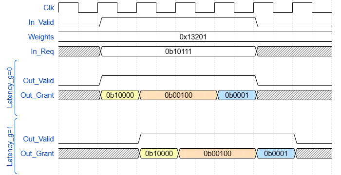
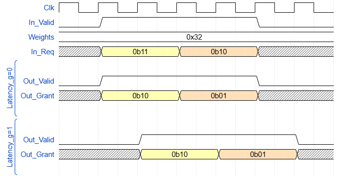

# olo_base_arb_wrr

[Back to **Entity List**](../EntityList.md)

## Status Information

VHDL Source: [olo_base_arb_wrr](../../src/base/vhdl/olo_base_arb_wrr.vhd)

## Description

This entity implements a weighted round-robin arbiter. Each input in the _In\_Req_ vector is assigned a configurable
weight via the _Weights_ vector. The weight specifies how many identical grants on the _Out\_Grant_ vector can be
issued consecutively before the arbiter moves to the next grant.

When _In\_Valid_ is asserted, the arbiter checks active requests and produces a grant.

- If _Latency\_g = 0_: _Out\_Valid_ is asserted in the same clock cycle.
- If _Latency\_g = 1_: _Out\_Valid_ is asserted one clock cycle later. In return this option can run at
  higher clock frequencies.

_Out\_Valid_ indicates that _Out\_Grant_ holds a valid result. _Out\_Grant_ may be one-hot or all-zero
if no grant is possible, such as when all weights are zero, there are no active requests or a combination of both.

### Example

The following waveforms show scenarios with No _Latency_g=0_ and with _Latency_g=1_, highlighting signal behavior
in each case. Note that for all figures, _WeightWidth_g=4_ is assumed, so every weight maps
to a single hex-digit, which is easy to read.

In the first cycle, the first requester gets a grant.

In the second cycle the grant is switched to the next entitled requester because the _Weights_ for the
first requester is only 1 and it already got that one grant. The second requester did not request a grant
(_In_Req_='0').

Hence the third requester gets the grant for two cycles (becaust the corresponding _Weight_ is 2).

In the last cycle, the last requester gets the grant. The second last requester does _not_ get a grant
although _In_Req='1'_ because the corresponding _Weight_ is zero.

### Important Note on Input Timing

_Weights_ is treated as a static control signal. Changes are reflected in the behavior of the arbiter within less than
5 clock cycles or one input sample.

Normally this does not play a role becaus _Weights_ in most applications is static. However, if _Weights_
changes dynamically this must be kept in mind.

This is an implementation tradeoff chosen to limit the lenght of combinatorial paths (i.e. to allow
higher clock frequencies).

Changes in _In_Req_ are applied immediately.

**Requests Change:**

## Generics

| Name          | Type     | Default | Description                                                  |
| :------------ | :------- | ------- | :----------------------------------------------------------- |
| GrantWidth_g  | positive | -       | Number of requesters (number of bits in _In\_Req_ and _Out\_Grant_ vectors) |
| WeightWidth_g | positive | -       | Number of bits in single weight |
| Latency_g     | natural  | 0       | Allowed values:  **0** - for combinatorial operation,  **1** - for registered operation |

## Interfaces

### Control

| Name | In/Out | Length | Default | Description                                     |
| :--- | :----- | :----- | ------- | :---------------------------------------------- |
| Clk  | in     | 1      | -       | Clock                                           |
| Rst  | in     | 1      | -       | Reset input (high-active, synchronous to _Clk_) |

### Static Configuration

| Name       | In/Out | Length                         | Default | Description                                                  |
| :--------- | :----- | :----------------------------- | ------- | :----------------------------------------------------------- |
| Weights    | in     | _GrantWidth\_g*WeightWidth\_g_ | -       | Weights for each requestor, static control signal |

### Request Interface

| Name       | In/Out | Length                         | Default | Description                                                  |
| :--------- | :----- | :----------------------------- | ------- | :----------------------------------------------------------- |
| In_Valid   | in     | 1                              | -       | AXI4-Stream handshaking signal for _In\_Weights_ and _In\_Req_ |
| In_Req     | in     | _GrantWidth\_g_                | -       | Request vector. The highest (left-most) bit has highest priority |

### Grant Interface

| Name      | In/Out | Length          | Default | Description                                                  |
| :-------- | :----- | :-------------- | ------- | :----------------------------------------------------------- |
| Out_Valid | out    | 1               | N/A     | AXI4-Stream handshaking signal for _Out\_Grant_ |
| Out_Grant | out    | _GrantWidth\_g_ | N/A     | Grant output signal |

## Architecture

Not described in detail. Refer to the code for details.
