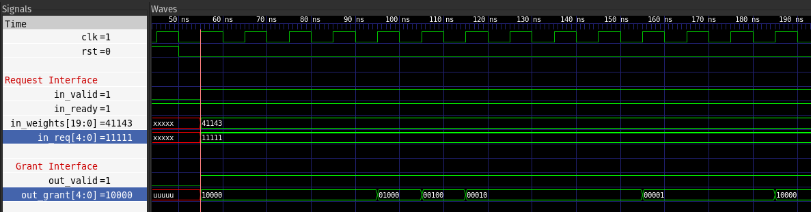
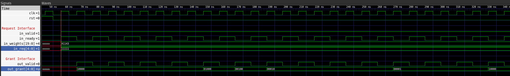

# olo_base_arb_wrr

[Back to **Entity List**](../EntityList.md)

## Status Information

VHDL Source: [olo_base_arb_wrr](../../src/base/vhdl/olo_base_arb_wrr.vhd)

## Description

This entity implements a weighted round-robin arbiter. Each input in the _In\_Req_ vector is assigned a configurable weight via the _In\_Weights_ vector. The weight specifies how many identical grants on the _Out\_Grant_ vector can be issued consecutively before the arbiter moves to the next grant.

**Waveform with No Latency (Latency_g = 0):**

**Waveform with Latency (Latency_g = 1):**

## Generics

| Name          | Type     | Default | Description                                                  |
| :------------ | :------- | ------- | :----------------------------------------------------------- |
| GrantWidth_g  | positive | -       | Number of requesters (number of bits in _In\_Req_ and _Out\_Grant_ vectors) |
| WeightWidth_g | positive | -       | Number of bits in single weight |
| Latency_g     | natural  | -       | Allowed values:  **0** - for combinatorial operation,  **1** - for registered (pipelined) operation |

## Interfaces

### Control

| Name | In/Out | Length | Default | Description                                     |
| :--- | :----- | :----- | ------- | :---------------------------------------------- |
| Clk  | in     | 1      | -       | Clock                                           |
| Rst  | in     | 1      | -       | Reset input (high-active, synchronous to _Clk_) |

### Request Interface

| Name       | In/Out | Length                         | Default | Description                                                  |
| :--------- | :----- | :----------------------------- | ------- | :----------------------------------------------------------- |
| In_Valid   | in     | 1                              | -       | AXI4-Stream handshaking signal for _In\_Weights_ and _In\_Req_ |
| In_Ready   | out    | 1                              | N/A     | AXI4-Stream handshaking signal for _In\_Weights_ and _In\_Req_ |
| In_Weights | in     | _GrantWidth\_g*WeightWidth\_g_ | -       | Weights for each requestor |
| In_Req     | in     | _GrantWidth\_g_                | -       | Request vector. The highest (left-most) bit has highest priority |

### Grant Interface

| Name      | In/Out | Length          | Default | Description                                                  |
| :-------- | :----- | :-------------- | ------- | :----------------------------------------------------------- |
| Out_Valid | out    | 1               | N/A     | AXI4-Stream handshaking signal for _Out\_Grant_ |
| Out_Grant | out    | _GrantWidth\_g_ | N/A     | Grant output signal |

## Architecture

Not described in detail. Refer to the code for details.
