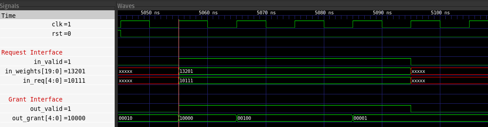
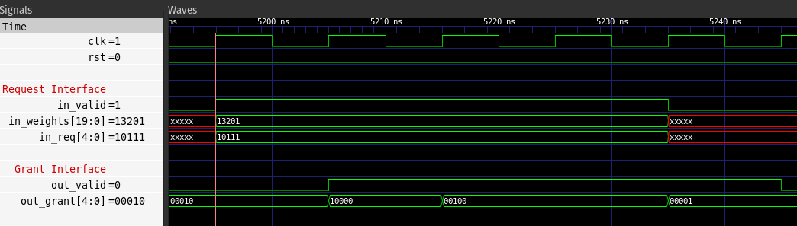
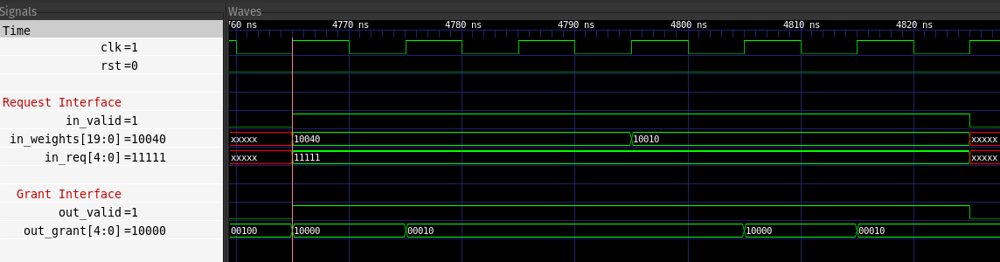

# olo_base_arb_wrr

[Back to **Entity List**](../EntityList.md)

## Status Information

VHDL Source: [olo_base_arb_wrr](../../src/base/vhdl/olo_base_arb_wrr.vhd)

## Description

This entity implements a weighted round-robin arbiter. Each input in the _In\_Req_ vector is assigned a configurable
weight via the _In\_Weights_ vector. The weight specifies how many identical grants on the _Out\_Grant_ vector can be
issued consecutively before the arbiter moves to the next grant.

When _In\_Valid_ is asserted, the arbiter checks active requests and produces a grant.

- If _Latency\_g = 0_: _Out\_Valid_ is asserted in the same clock cycle.
- If _Latency\_g = 1_: _Out\_Valid_ is asserted one clock cycle later.

_Out\_Valid_ indicates that _Out\_Grant_ holds a valid result. _Out\_Grant_ may be one-hot or all-zero
if no grant is possible, such as when all weights are zero, there are no active requests or a combination of both.

The following waveforms show scenarios with No Latency and with Latency, highlighting signal behavior in each case.

**Waveform with No Latency (Latency_g = 0):**

**Waveform with Latency (Latency_g = 1):**

## Important Note on Input Timing

_In\_Weights_ requires one additional clock cycle to be registered and applied compared to _In\_Req_.
Because of this timing difference, it’s important to keep it in mind when working with the entity,
which assumes that _In\_Weights_ remains mostly static and changes infrequently.
The following waveforms illustrates this difference with no latency applied.
One shows _In\_Req_ changing between arbitration cycles, and the other shows _In\_Weights_ changing,
allowing you to observe the timing impact on arbitration behavior.

**Requests Change:**

**Weights Change:**

## Generics

| Name          | Type     | Default | Description                                                  |
| :------------ | :------- | ------- | :----------------------------------------------------------- |
| GrantWidth_g  | positive | -       | Number of requesters (number of bits in _In\_Req_ and _Out\_Grant_ vectors) |
| WeightWidth_g | positive | -       | Number of bits in single weight |
| Latency_g     | natural  | 0       | Allowed values:  **0** - for combinatorial operation,  **1** - for registered operation |

## Interfaces

### Control

| Name | In/Out | Length | Default | Description                                     |
| :--- | :----- | :----- | ------- | :---------------------------------------------- |
| Clk  | in     | 1      | -       | Clock                                           |
| Rst  | in     | 1      | -       | Reset input (high-active, synchronous to _Clk_) |

### Request Interface

| Name       | In/Out | Length                         | Default | Description                                                  |
| :--------- | :----- | :----------------------------- | ------- | :----------------------------------------------------------- |
| In_Valid   | in     | 1                              | -       | AXI4-Stream handshaking signal for _In\_Weights_ and _In\_Req_ |
| In_Weights | in     | _GrantWidth\_g*WeightWidth\_g_ | -       | Weights for each requestor |
| In_Req     | in     | _GrantWidth\_g_                | -       | Request vector. The highest (left-most) bit has highest priority |

### Grant Interface

| Name      | In/Out | Length          | Default | Description                                                  |
| :-------- | :----- | :-------------- | ------- | :----------------------------------------------------------- |
| Out_Valid | out    | 1               | N/A     | AXI4-Stream handshaking signal for _Out\_Grant_ |
| Out_Grant | out    | _GrantWidth\_g_ | N/A     | Grant output signal |

## Architecture

Not described in detail. Refer to the code for details.
